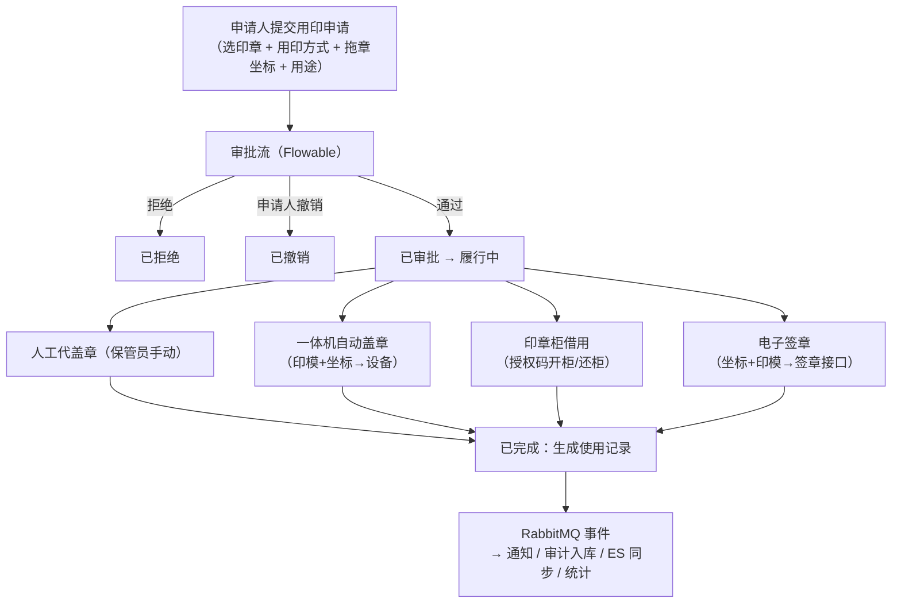
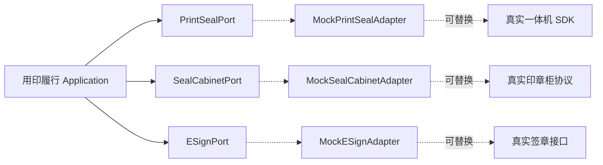
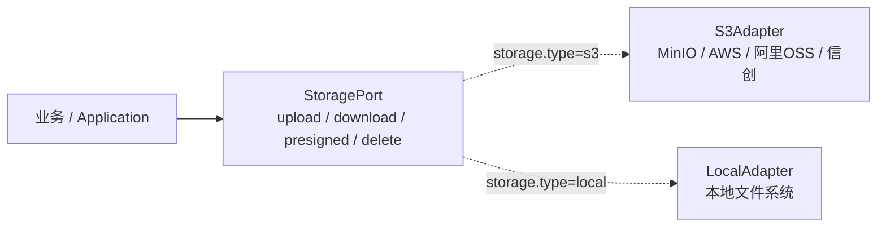
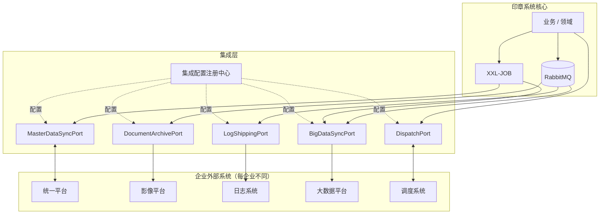

# 印章管理系统 · 后端技术架构

> 面向大型央国企/国企集团的**多法人实体**印章管理平台：实体印章 + 电子印章全生命周期、用印申请与审批、智能设备（一体机/印章柜）集成、电子签章对接、审计与统计。
>
> 本系统同时是**练习/简历项目**：在真实业务建模前提下，选型偏向可识别、高频的企业 Java 技术栈，并保持信创可移植。

---

## 1. 设计原则

| 原则 | 说明 | 依据 |
|---|---|---|
| 端口-适配器（六边形） | 业务逻辑不依赖设备/厂商 SDK，通过 Port 抽象 | ADR-0004 |
| 多租户行级隔离 | 每张业务表带 `legal_entity_id`，访问层自动过滤 | ADR-0002 |
| 信创可移植 | 标准 SQL、框架无关 API、抽象端口 | ADR-0001 |
| 配置驱动 | 审批流、编号规则、通知渠道等均按法人实体可配置 | — |

---

## 2. 技术栈

| 类别 | 选型 | 版本 | 用途 |
|---|---|---|---|
| 语言 | Java | 17 (LTS) | |
| 应用框架 | Spring Boot | 3.x | Web/事务/自动装配 |
| 持久层 | MyBatis-Plus | 3.5.x | ORM + **多租户插件**（行级隔离） |
| 数据库 | PostgreSQL | 15 | 主库（OpenGauss/人大金仓可迁移） |
| 缓存 | Redis | 7.x | 缓存 / 会话 / 分布式锁 / 限流计数 |
| 消息队列 | **RabbitMQ** | 3.x | 异步消息：通知 / 审计 / 设备事件 / 副作用 |
| 分布式调度 | **XXL-JOB** | 2.4.x | 定时任务（借用超时、排班轮值、报表、归档） |
| 搜索分析 | **Elasticsearch** | 8.x | 审计日志 / 用印记录检索 + 集团统计 |
| 工作流 | Flowable | 7.x | 审批引擎（BPMN） |
| 对象存储 | StoragePort + S3(MinIO 等)/本地 双适配器 | — | 印模/文档/扫描件/签章PDF；配置切换 |
| 认证授权 | Spring Security + JWT | — | 认证 + RBAC，SSO-ready |
| 实时通信 | WebSocket (STOMP) | — | 站内信实时推送 |
| 审计日志 | Spring AOP + 注解 | — | `@OperationLog` 切面异步入库 |
| 构建 | Maven | — | |
| 部署 | Docker Compose / K8s / GitHub Actions | — | 本地一键起 + 生产化 + CI/CD |

> 三项加粗（RabbitMQ / XXL-JOB / Elasticsearch）为本轮新增的"刚需"基础设施（ADR-0005）。

### 未来可增强（未纳入本次）
Flyway（DB 迁移）、Testcontainers（集成测试）、Knife4j（API 文档）、Druid（连接池监控）、MapStruct（Bean 映射）、Prometheus+Grafana（指标）、SkyWalking（链路追踪）、Sentinel（限流熔断）、Nacos（配置中心，若上微服务）。

---

## 3. 架构分层（端口-适配器 / 六边形）

```mermaid
flowchart LR
    subgraph Driving["Driving Adapters（入站）"]
        REST["REST Controllers"]
        WS["WebSocket / STOMP"]
        JOB["XXL-JOB Handler"]
        MQC["RabbitMQ Consumer"]
    end
    subgraph Core["应用 + 领域核心（不依赖基础设施）"]
        APP["Application Services / Use Cases"]
        DOM["Domain Model（印章/用印/审批/岗位/编号…）"]
        PORT["Ports（端口接口）"]
    end
    subgraph Driven["Driven Adapters（出站）"]
        DB[("PostgreSQL")]
        CACHE[("Redis")]
        MQ[("RabbitMQ")]
        ES[("Elasticsearch")]
        MINIO[("MinIO")]
        FLOW["Flowable Engine"]
        DEV["设备/签章 Adapters（Mock）"]
        NOTIFY["通知 Adapters（站内信/企微/钉钉/邮件）"]
    end
    REST --> APP
    WS --> APP
    JOB --> APP
    MQC --> APP
    APP --> DOM
    APP --> PORT
    PORT --> DB & CACHE & MQ & ES & MINIO & FLOW & DEV & NOTIFY
```



**核心约束**：领域层 + 应用层只依赖 Port 接口，不 import 任何基础设施/厂商类。设备（一体机/印章柜）、签章接口、通知渠道、存储都通过 Port 暴露，练习期提供 Mock 实现（ADR-0004）。

---

## 4. 模块 / 包结构

按**领域上下文**切分，每个上下文内部六边形分层：

```
com.cyz.seal
├── seal                # 印章上下文
│   ├── domain            # Seal / SealStatus / Impression(印模) / NumberingRule
│   ├── application       # 用例：建章入库、保管员变更、盘点、销毁
│   ├── infrastructure
│   │   ├── persistence     # MyBatis-Plus mapper
│   │   └── numbering       # 流水号分配器（占号/跳号/并发安全）
│   └── interfaces         # REST
├── usage               # 用印申请上下文（申请 / 用印方式 / 履行 / 使用记录）
├── approval            # 审批上下文（Flowable 集成 + 岗位/排班解析胶水）
├── integration         # 设备/签章 ports + adapters
│   ├── printseal          # 一体机 port + mock
│   ├── cabinet            # 印章柜 port + mock（授权码、开/还事件）
│   └── esign              # 签章接口 port + mock（拖章坐标+印模→签章）
├── org                 # 集团 / 法人实体 / 部门 / 岗位 / 排班 / B角
├── iam                 # 用户 / 角色 / 权限 / Spring Security
├── notification        # 通知 ports + adapters（站内信/企微/钉钉/邮件）+ MQ 生产/消费
├── audit               # 审计日志（AOP 切面 → MQ → PG + ES）
├── search              # Elasticsearch 索引同步 + 查询（审计/用印/统计）
├── scheduler           # XXL-JOB handler（借用超时、排班轮值、报表、归档）
├── storage             # MinIO port + adapter
└── common              # 多租户上下文持有者、异常、基础实体、Result 封装
```

---

## 5. 多法人数据隔离

- 每张业务表带 `legal_entity_id`；MyBatis-Plus `TenantLineInnerInterceptor` 自动注入过滤条件（ADR-0002）。
- 请求进入时，`LegalEntityContext` 从 JWT/请求中解析当前法人实体并持有；多租户插件读取之。
- **集团审计/统计**走显式"忽略租户"路径，仅授予 `集团审计员/集团管理员`，且单独审计。
- Flowable 自有表为全局表：流程实例以 `businessKey` + 流程变量绑定 `legal_entity_id`，查询任务/历史时在应用层叠加法人过滤（ADR-0003）。
- Elasticsearch 文档携带 `legal_entity_id`，按实体过滤；集团视角走特权查询。

---

## 6. 用印申请核心流程



- **用印申请状态机**：草稿 → 审批中 → {已拒绝 | 已撤销 | 已审批} → 履行中（含设备异步子状态）→ {已完成 | 失败/超时}（详见 `CONTEXT.md`）。
- **拖章定位**产出**坐标**，一体机与电子签章渠道共用（印章柜渠道不需要）。
- 设备/签章交互为**异步**：履行中维护 pending → in-progress → confirmed，靠回调/轮询推进（ADR-0004）。

---

## 7. 审批引擎

- **Flowable** 承载流程编排：BPMN 流程定义、任务、历史；会签/或签/单签用**多实例任务 + 完成条件**；上报集团用**排他网关 + 条件**（ADR-0003）。
- **自定义解析胶水**（核心难点）：通过 task listener / candidate 表达式调用 Java bean，按 **岗位 + 排班** 解析**当值**审批人，处理 **B角顶替** 与 **双岗**（详见 `CONTEXT.md` 的 岗位/B角/当值/排班/签批方式）。
- 审批流定义**版本化**：在途申请继续跑其启动时的版本，不受后续改版影响。

---

## 8. 异步与消息（RabbitMQ）

| 用途 | Exchange / Queue 示例 | 说明 |
|---|---|---|
| 通知派发 | `notify.exchange` → 各渠道队列 | 审批结果/待办/超时 → 站内信(WebSocket) / 企微 / 钉钉 / 邮件 |
| 审计日志 | `audit.queue` | AOP 切面投递 → 消费者写 PG + 同步 ES |
| 设备事件 | `device.event.queue` | 一体机/印章柜/签章回调、状态变更 |
| 用印副作用 | `usage.completed.queue` | 统计更新、文档归档等后置动作 |

- **可靠性**：至少一次投递 + 消费者幂等（业务唯一键去重）；持久化队列 + 手动 ack。
- **站内信实时性**：通知消费者写库后，经 WebSocket 通道推送给在线用户。

---

## 9. 分布式调度（XXL-JOB）

| 任务 | 触发 | 作用 |
|---|---|---|
| 借用超时提醒 | 定时（如每 5 分钟） | 扫描"履行中-借出"超期未还，发提醒/升级 |
| 排班轮值 | 定时（每日） | 推进岗位当值人切换（A角↔B角） |
| 集团报表 | 定时（日/周/月） | 跨实体用印统计 → ES 聚合 → 推送/导出 |
| 数据归档/清理 | 定时 | 归档历史申请、清理过期临时文件 |
| 遗失公告核查 | 定时 | 遗失印章公告作废期满处理 |

- 调度在 XXL-JOB Admin 集中管理，执行器以独立线程池跑，不阻塞 Web 请求。

---

## 10. 搜索与分析（Elasticsearch）

- **索引**：`audit-log-*`、`usage-record-*`，文档带 `legal_entity_id` + 时间分片。
- **同步**：审计/用印记录经 RabbitMQ 消费者写入 ES（非业务事务内双写，保证最终一致 + 幂等）。
- **查询**：法人实体内全文检索（操作人/动作/印章/文档关键字）；集团审计员跨实体检索 + 聚合统计（按实体/类型/时间分布）。
- ES 仅作**检索/统计读模型**，PG 仍为事实来源。

---

## 11. 集成适配器（端口-适配器）



- 三类 Port：一体机（上传印模+文档+坐标 → 打印并自动盖章）、印章柜（授权码开/还、不自动盖章）、签章接口（坐标+印模 → 真实电子签章）。
- 练习期全部 Mock，配置开关切换；真实适配器将来可插拔，业务不动（ADR-0004）。

---

## 12. 认证与权限

- **Spring Security + JWT**：登录签发 JWT，请求过滤器校验；RBAC 基于 7 角色模型。
- **SSO-ready**：抽象 `AuthenticationProvider` / OAuth2 client，预留统一身份（CAS/OAuth2）对接入口。
- **法人实体上下文**从 JWT claim 解析，注入多租户插件。
- 权限粒度：角色 + 资源（菜单/按钮/接口）+ 数据范围（本实体 / 跨实体集团视角）。

---

## 13. 审计日志

- `@OperationLog` 注解 + AOP 切面，自动捕获：操作人 / 时间 / 动作 / 实体类型-ID / 改前改后 / IP / 结果。
- 异步：切面投递到 RabbitMQ `audit.queue`，消费者写 PG（事实源）+ ES（检索）。
- 独立审计表带 `legal_entity_id`；集团审计员可跨实体查询与导出。

---

## 14. 文件存储（可切换：S3 / 本地）

- 存储内容：印模图片、待用印文档（拖章查看器加载）、扫描盖章件、签章 PDF、印章档案照片。
- **StoragePort** 抽象 + 两套适配器，由配置切换（`storage.type=s3|local`）：



  - **S3 适配器**：S3 协议，兼容 MinIO / AWS S3 / 阿里云 OSS(S3 兼容) / 信创对象存储。
  - **本地适配器**：本地文件系统（开发 / 无 S3 环境使用）。
- 本地开发用 `local`（零依赖），生产/信创用 S3 —— 体现可移植（ADR-0001），与端口-适配器一致（ADR-0004）。
- 上传走预签名 URL（S3）/ 本地签名路径（local）；访问按法人实体 + 业务权限鉴权。
- **长期归档流转**：MinIO/本地为工作存储；用印完成后，已盖章文档经 `DocumentArchivePort` 归档到企业**影像平台**（见第 15 节），归档后按策略清理 MinIO 旧档。
- 详见 [ADR-0006](./adr/0006-switchable-storage-s3-local.md)。

---

## 15. 三方集成层（Enterprise Integration Layer）

系统作为产品给不同企业部署，每家企业周边系统生态不同。集成层把这些接入抽象为**集成能力 = 端口 + 适配器 + 配置**，建在事件总线 + 调度器之上（[ADR-0007](./adr/0007-integration-layer-ports-adapters.md)）。



### 集成能力清单

| 能力 | 端口 | 方向 | 模式 | 触发 | 说明 |
|---|---|---|---|---|---|
| 统一平台同步 | `MasterDataSyncPort` | 入站 | 增量/全量 + 拉/Webhook | XXL-JOB 定时 + 事件 | 机构/人员主数据同步，外部为准 |
| 影像平台归档 | `DocumentArchivePort` | 出站 | 事件驱动 | 用印完成/文档产生 | 复用 MQ 事件，订阅转发 |
| 日志推送 | `LogShippingPort` | 出站 | 事件驱动 | 审计/操作日志事件 | 审计消费者额外转发 |
| 大数据同步 | `BigDataSyncPort` | 出站 | 批量/事件 | XXL-JOB + MQ | 用印/审计数据同步 |
| 调度系统对接 | `DispatchPort` | 双向 | 请求/事件 | 实时 + 事件 | 跨系统任务交接 |

### 设计要点

- **业务只依赖端口**；未启用的能力为 no-op。
- **事件型集成复用现有 MQ 事件**（审计、用印完成等），适配器作为额外消费者订阅转发，不侵入业务。
- **每企业部署**：集成配置注册中心记录启用的能力 + 选择的适配器 + 连接参数。
- **可靠性**：每适配器独立重试/退避/DLQ + 熔断；幂等接收（外部系统可能重投）。
- 与第 11 节设备集成（一体机/印章柜/签章）是同一端口-适配器思想的两个层面：设备层印章专用，集成层面向企业生态。

### 统一平台同步（细化）

**边界（谁为准）**：统一平台拥有 **法人实体 / 部门 / 人员 / 职位**（只读同步）；印章系统拥有 **岗位 / 排班 / B角 / 角色 / 保管员** 等"印章覆盖层"，引用已同步的人员/org。统一平台的人员变动（入职/调岗/离职）自动同步，印章审批的当值/排班逻辑不被触碰。无统一平台的部署 → 回退手工维护。

**同步机制**：增量定时（`updated_at` 水位）为主 + Webhook 实时推送（若统一平台支持）+ 定时全量对账（每日，修正漂移）。无 Webhook 时退化为增量 + 全量对账。

**外部 ID 映射**：每条同步记录存储统一平台的稳定 ID，用于幂等 upsert 与重同步匹配；内部 ID 与外部 ID 分离。

**删除/停用处理**：统一平台删除人/机构 → 软删除（标记"已停用/已离职"），保留历史（用印记录/审计仍可追溯）；**清空**其印章角色/岗位/排班；其在途审批任务**自动改派**给同岗位当值人（走岗位/排班解析逻辑，找不到则升级/通知法人管理员）。不硬删。

**频率**：增量 5–10 分钟，全量对账每日；每次同步记录水位/成功失败，供监控与重试。

### 其他集成能力细化

> **通则**：每个集成能力的**模式可配置**（按部署在集成配置注册中心选择），因为不同企业系统支持的能力不同（实时推送 vs 批量、Webhook vs 拉取等）。事件型集成统一复用 RabbitMQ 事件作为额外消费者，不侵入业务。

**影像平台归档**（`DocumentArchivePort`）：MinIO = 工作存储（用印期间），影像平台 = 长期归档。**用印完成**事件触发，异步归档**已盖章文档**（实体章扫描盖章件 / 电子章签章 PDF）+ 用印元数据；归档后 MinIO 对应文件按策略清理。**印模不归档**（配置数据，非业务记录）。失败重试，归档状态可查。

**调度系统对接**（`DispatchPort`，双向）：
- 入站：调度系统（或经它的业务系统）向印章系统**发起用印申请**，走标准申请-审批流。
- 出站：用印完成事件**推送**给调度系统，由它分发给下游业务系统。

**日志推送**（`LogShippingPort`）：复用审计日志 MQ 管道，作为额外消费者订阅。**模式可配置**——实时随事件推送 或 批量定时推送。范围 = 审计/操作日志；纯技术日志（GC/JVM/访问）走独立采集，不归业务侧。

**大数据同步**（`BigDataSyncPort`）：同步用印记录 + 审计数据。**模式可配置**——批量定时（每日 T+1）或 准实时（MQ 事件）。下游大数据平台按其接入能力选择。

---

## 16. 部署

- **本地/dev**：`docker-compose up` 一键拉起 postgres / redis / rabbitmq / elasticsearch / minio / xxl-job-admin / 后端 / vue / react / h5。
- **生产化（可选）**：K8s 清单（Deployment/Service/Ingress），后端无状态可水平扩。
- **CI/CD**：GitHub Actions —— 构建、测试、镜像推送、部署。

---

## 17. 关键决策（ADR）

| ADR | 决策 |
|---|---|
| [0001](./adr/0001-tech-stack-and-xinchuang-portability.md) | 技术栈 + 信创可移植（PG/MyBatis-Plus/标准 SQL） |
| [0002](./adr/0002-multi-entity-row-level-isolation.md) | 多法人行级隔离（`legal_entity_id` + 多租户插件） |
| [0003](./adr/0003-flowable-approval-engine.md) | 审批引擎：Flowable + 自定义岗位/排班解析胶水 |
| [0004](./adr/0004-integrations-ports-and-adapters-mocked.md) | 设备/签章集成：端口-适配器 + Mock |
| [0005](./adr/0005-async-scheduling-search-infra.md) | 异步/调度/搜索：RabbitMQ + XXL-JOB + Elasticsearch |
| [0006](./adr/0006-switchable-storage-s3-local.md) | 文件存储：可切换 S3 / 本地双适配器 |
| [0007](./adr/0007-integration-layer-ports-adapters.md) | 三方集成层：能力端口 + 企业适配器 + 配置注册 |

> 领域术语与状态机详见 [`CONTEXT.md`](../CONTEXT.md)。
